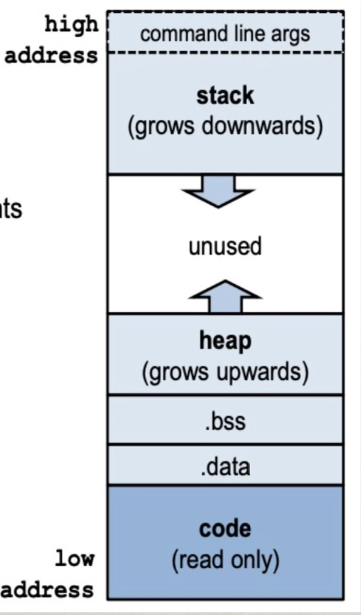

1-27-20
# Virtualization: The CPU
Questions answered in this lecture:
* What is a process?
* Why is limited direct execition a good approach for virtualizing the CPU?
* What execution state must be saved for a process?
* What 3 modes can a process work in?

## What is a process?
An **execution stream** in the context of a **process state**. <br>
<br>
What is an **exection stream**?
* Stream of executing instructions
* Running piece of code
* "thread control"

What is a **process state**?
* Everything that the running code can afect or be affected by
* Registers
    * General purpose, floating point, status, program counter, stack pointer
    * program counter is like a global variable for everything in that CPU, keeping track of where that process is
    * stack pointer tells exactly in which part of the stack you are (*clarify between this and program counter*()
* Address space
    * Heap, stack and code
* Open files

## Processes vs Programs
A process is different than a program:
* Program: static code and static data.
* Process: Dynamic instance of code data.

Can have multiple process instances of the same program.
* Example: many users running `ls` at the same time.

## Processes vs Threads
Thread: A "lightweight" abstraction of a process.
* An execution stream that shares an address space.
* Multiple threads within a single process share this same address space.
* Each will have their own stacks and heap, though share address space so could potentially access each others stacks.

## Process Memory Segment

<br>
<br>
* The OS allocates memory for each process.
* **Stack** - For local variables, including command line arguments and environment variables.
* **Heap** - For dynamically allocated memory.
* Data segment for:
    * global uninitialized variables (.bss)
    * global initialized variables (.data)
* Code segment - typicallyt read-only.

## Virtualizing the CPU
**Goal**: Give each process the impression that it is alone in actively using CPU.

Resouces can be shrared in time and space.
Assume single uniprocessor:
* You use **timseharing**, which allows you to run as many concurrent processes as you like, where the potential cost is performance.
    * **Mechanisms** allow this to happen, which performs a **context switch**, which gives the OS the abiliity to stop running one program and start running another on a given CPU.
* Memory and Disk? - you use space sharing.<br>

## How to Provide Good CPU Performance?
**Direct execution**
* Allow user process to run directly on hardware.
* OS creates process and transfers control to starting point. (i.e., main())

Problems with direct execution?
* Process could do something restricted 
    * Could read/write other process data. (disk or memory)
* Process could run forever (slow, buggy, or malicious)
    * OS needs to be able to switch between processes
* Process could do something slow (Like I/O)
    * OS wants to use resources efficiently and switch CPU to other process when necessary

The Solution - **Limited Direct execution**.

## Problem 1: Restricted Operations
How can we ensure user process cant harm others?

Solution: privlege levels supported by hardware (bit of status)
* User processes run in user mode (restricted mode)
* OS runs in kernel mode (not restricted)
    * Instructions for interacting with devices
    * Could have many privelage levels (advanced levels)

How can process access device?
* System calls
    * Like a gateway to interact with OS, and get the OS to implement a function call.
    * Interface between Application to Kernel,used to switch program from untrusted to trusted state
    * System calls are implemented within the OS, in the kernel and can not be implemented within an application.
* Change privelage level through system call (also known as a trap)

*Look through System Call slides*

Process P wants to read a file but can not acccess it because of **user mode**, meaning it can only read memory within its own process.
* Uses interrupt $64 to indicate it wished to use a system call. (from trap-table)
* Uses system call $6 to indicate it wants to read. (from syscall-table)
* It is not in Kernel mode and can access everything.


### What to limit?
User processes are not allowed to perform:
* General memory access
* Disk I/O
* Special x86 instructions like `lidt`


## Problem 2: How to take CPU away from time-consuming tasks?
OS requirements for **multiprogramming** or multitasking.
* Mechanism
    * To switch between processes
* Policy
    * To decide which process to schedule when

Seperation of policy and mechanism
* Reoccuring theme in OS
* **Policy**: Decision-maker to optimize some workload performance metric
    * Which process when?
    * Process **Scheduler**: Future lecture
* **Mechanism**: Low-level code that implements the decision.
    * How?
    * Process **Dispatcher**: Todays lecture

### Dispatch Mechanism
OS runs dispatch loop:
```
while (1) {
    run process A for some time-slice
    stop process A and save its context
    load context of another process B
}
```
 This is referred to as a **Context-swtich**.
* Question 1: How does the dispatcher gain control?
* Question 2: What exection context must be saved and restored?

### How does Dispatcher gain control?
Option 1: **Cooperative Multi-tasking** (older)

Trust process to relinquish CPU to OS through traps
* Examples: system call, page fault (access page not in memory) or error (illegal instruction or divide by zero).
* Provide special `yield()` system call.
    
Doesnt really work because programs do not want to yield
* Writing programs that want to yield would contrasts the purpose of virtualization - allowing programs to run as if they have full control of CPU..

Disadvantages: Processes can misbehave
* By avoiding traps and performing no I/O, cthey can take over the entire machine.
* This makes the only soultiin to Reboot the machine.

For ths reason Cooperative Multi-tasking is not used in modern operating systems.

Option 2: **True Multi-Tasking**
* Guarantee OS can obtain control periodically.
* Enter OS by enabling periodic alarm clock.
    * Hardware generates timer interrupt (CPU or seperate chip)
    * Example: every 10ms
* User must not be able to mask timer interrupt.
* Dispatcher counts interrupts between context switches
    * Example: waiting 20 timer ticks gives 200ms time slice
    * Comon time slices range between 10ms and 200ms

## What context must be saved?
Dispatcher must track context of process when not running
* Save context in **process control block (PCB)**
* PCB is a structure maintained for each process in the OS

What information is in stored in PCB?
* PID
* Process state (I.e., running, ready or blocked)
* Execution state (all registers, PC, stack, ptr) -- context
* Scheduling priority (will dive into more deeply later)
* Accounting information (parent and child processes)
* Credentials (which resources can be accessed, owner)
* Pointers to other allocated resources (e.g., open files)

### What's inside a PCB?
```
// the information xv6 tracks about each process
// including its register context and state
struct proc {
    char *mem;                  // Start of process memory
    uint sz;                    // Size of process memory
    char *kstack;               // Bottom of kernel stack
    enum proc_state state;      // Process state
    int pid;                    // Process ID
    struct proc *parent;        // Parent process
    int killed;                 // If non-zero, killed
    struct file *ofile[NOFILE]; // Open files
    struct inode *cwd;          // Current working dir
    struct context context;     // Switch here to run process
    struct trapframe *tg        // current interrupt
};
```
### How Context is saved
Example: Process A has moved from user to kernel mode, and the OS decides it must switch from A to B:
* Save context of A on kernel stack.
* Switch Stack Pointer to kernel stack of B.
* Restore context from B's kernel stack.
* Now, CPU is running B in kernel mode, return-from-trap to switch to user mode of B.

### What information must the Context save?
```
// the registers will save and restore
// to stop and subsequently restart a process
struct context {
    int eip;            // Index pointer register
    int esp;            // Stack pointer register
    int ebx;            // Called the base register
    int ecx;            // Called the counter register
    int edx;            // Called the data register
    int esi;            // Source index register
    int edi;            // Destination index register
    int ebp;            // Stack base pointer register
};

// the different states a process can be in
enum proc_state { UNUSED, EMBRYO, SLEEPING,
                RUNNABLE, RUNNING, ZOMBIE };
```
## How to prevent slow Operations such as I/O?
When running a process that performs operations that do not use CPU, OS switches to process that needs CPU (policy issues)

The OS must track mode of each process:
* Running:
    * On the CPU (Only one on a uniprocessor)
* Ready:
    * Waiting for the CPU
* Blocked:
    * Asleep, waiting for I/O or synchornization to complete

OS must track every process in system
* Each process indentified by unique Process ID (PID)

OS maintains queues of all processes
* Ready queue: Contains all ready processes
* Event queue: One logical queue per event
    * e.g. disk I/O and locks
    * Contains all processes waiting for that event to complete

---
## Summary
Virtualization:
* Context switching gives each process the impression it has its own CPU

Direct execution makes processes fast

Limited exectution at key points to ensure OS retains control

Hardware proces a lot of OS support
* user vs kernel mode
* timer interrupts
* automatic register saving
